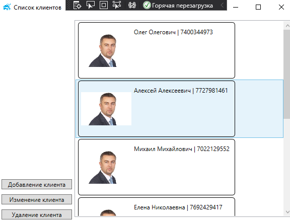

<table style="width: 100%;">
  <tr>
    <td style="text-align: center; border: none;"> 
        Министерство образования и науки РФ <br/>
        ГБПОУ РМЭ "Йошкар-Олинский Технологический колледж 
    </td>
  </tr>
  <tr>
    <td style="text-align: center; border: none; height: 45em;">
        <h2>
            Курсовой проект <br/>
            "Проектирование и разработка информационных систем" <br/>
            для группы И-31
        <h2>
    </td>
  </tr>
  <tr>
    <td style="text-align: right; border: none; height: 20em;">
        <div style="float: right;" align="left">
            <b>Разработал</b>: <br/>
		Батанов Максим Андреевич<br/
            <b>Проверил</b>: <br/>
            Колесников Евгений Иванович
        </div>
    </td>
  </tr>
  <tr>
    <td style="text-align: center; border: none; height: 1em;">
        г.Йошкар-Ола, 2021
    </td>
  </tr>
</table>

<div style="page-break-after: always;"></div>

https://github.com/MaximBatanovYOTC/Kursa4
# Содержание

* [Теоретическая часть](#Теоретическая-часть)
* [Практическая часть, разработка бд](#Практическая-часть.-Разработка-БД)
* [Практическая часть, разработка кода ИС](#Практическая-часть.-Разработка-кода-ИС)

# Теоретическая-часть
## Диаграммы

### Предметная область Фитнесс-центр. Подсистема работы с услугами.

### Диаграмма Use Case:


### Диаграмма Последовательности:

### CСпецификация прецентдентов Use Case:


# Практическая часть
## Программирование С#

### Приложение было разработанно в Visual Studio, пример работы программы:
### Главное окно:

#### Пример кода разметки страницы:
```xml

<Window x:Class="Max.MainWindow"
        xmlns="http://schemas.microsoft.com/winfx/2006/xaml/presentation"
        xmlns:x="http://schemas.microsoft.com/winfx/2006/xaml"
        xmlns:d="http://schemas.microsoft.com/expression/blend/2008"
        xmlns:mc="http://schemas.openxmlformats.org/markup-compatibility/2006"
        mc:Ignorable="d"
        Title="Автосервис.Подсистема работы с клиентами" Height="450" Width="800">
    <Grid>
        <Grid.ColumnDefinitions>
            <ColumnDefinition Width="150"/>
            <ColumnDefinition Width="1*"/>
        </Grid.ColumnDefinitions>
        <Image  Margin="5" Source="auto.png" VerticalAlignment="Top"/>
        <StackPanel  Orientation="Vertical" VerticalAlignment="Bottom">
            <Button 
                Margin="5"
                Content="Cписок клиентов" 
                Name="ClientsButton" 
                Click="ClientsButton_Click"/>
            <Button 
                Margin="5"
                Content="Добавление" 
                Name="AddButton" 
                Click="AddButton_Click"/>

            <Button Margin="5" x:Name="EditOrdBtn"   Content="Изменение Заказа" Click="EditOrder_Click"></Button>
            <Button Margin="5" x:Name="DelOrdBtn"   Content="Удаление Заказа" Click="DelOrd_Click"></Button>
            <Button 
                Margin="5"
                Content="Выход" 
                Name="ExitButton" 
                Click="ExitButton_Click"/>


        </StackPanel>


        <Grid Grid.Column="1">
            <Grid.RowDefinitions>
                <RowDefinition Height="30"/>
                <RowDefinition Height="*"/>
                <RowDefinition Height="30"/>
            </Grid.RowDefinitions>

            <StackPanel 
                Orientation="Horizontal" 
                VerticalAlignment="Center">
                <Label Content="Цена: "/>
                <RadioButton 
                    GroupName="Price"
                    Tag="1"
                    Content="по возрастанию" 
                    IsChecked="True" 
                    Checked="RadioButton_Checked"
                    VerticalContentAlignment="Center"/>
                <RadioButton 
                    GroupName="Price" 
                    Tag="2"
                    Content="по убыванию" 
                    Checked="RadioButton_Checked"
                   VerticalContentAlignment="Center"/>
                <Label Content="Поиск"/>
                <TextBox
                    Width="70"
                    x:Name="SearchFilterTextBox"
                    VerticalAlignment="Center"
                    KeyUp="TextBox_KeyUp"/>
            </StackPanel>

            <ListView
                Grid.Row="1"
                ItemsSource="{Binding ServiceList}"
                x:Name="ProductListView">

                <ListView.ItemContainerStyle>
                    <Style 
                        TargetType="ListViewItem">

                        <Style.Triggers>
                            <DataTrigger
                            Binding="{Binding MaxBalance}"
                            Value="True">
                                <Setter
                                Property="Background"
                                Value="#FF08F9F9"/>
                            </DataTrigger>
                        </Style.Triggers>

                        <Setter 
                            Property="HorizontalContentAlignment"
                            Value="Stretch" />
                    </Style>
                </ListView.ItemContainerStyle>

                <ListView.ItemTemplate>
                    <DataTemplate>
                        <!-- рисуем вокруг элемента границу с загругленными углами -->
                        <Border 
                            BorderThickness="1" 
                            BorderBrush="Black" 
                            CornerRadius="5">
                            <!-- основная "сетка" из 3-х столбцов: картинка, содержимое, цена -->
                            <Grid 
                                Margin="10" 
                                HorizontalAlignment="Stretch">
                                <Grid.ColumnDefinitions>
                                    <ColumnDefinition Width="64"/>
                                    <ColumnDefinition Width="*"/>
                                    <ColumnDefinition Width="100"/>
                                </Grid.ColumnDefinitions>
                                <Image
                                    Width="64" 
                                    Height="64"
                                    Source="{Binding Path=ImagePreview}" />
                                <TextBlock 
                                    Text="{Binding BalanceString}" 
                                    Grid.Column="2" 
                                    HorizontalAlignment="Right" 
                                    Margin="10"/>
                                <!-- для содержимого рисуем вложенную сетку -->
                                <Grid Grid.Column="1" Margin="5">
                                    <Grid.RowDefinitions>
                                        <RowDefinition Height="20"/>
                                        <RowDefinition Height="20"/>
                                        <RowDefinition Height="*"/>
                                    </Grid.RowDefinitions>
                                    <StackPanel
                                        Orientation="Horizontal">
                                        <TextBlock
                                            Text="{Binding Number}"/>
                                        <TextBlock 
                                            Text=" | "/>
                                        <TextBlock 
                                            Text="{Binding AutoserviceMax.Fullname}"/>
                                        <TextBlock 
                                            Text=" | "/>
                                        <TextBlock 
                                            Text="{Binding RoleMax.Title}"/>
                                        <TextBlock 
                                            Text=" | "/>
                                        <TextBlock 
                                            Text="{Binding AutoserviceMax.PhoneNum}"/>
                                    </StackPanel>
                                    <TextBlock 
                                        Text="{Binding StartTimeText}" 
                                        Grid.Row="1"/>
                                </Grid>
                            </Grid>
                        </Border>
                    </DataTemplate>
                </ListView.ItemTemplate>
            </ListView>
            <StackPanel 
            Orientation="Horizontal"
            VerticalAlignment="Bottom"
            Grid.Column="1"
            Grid.Row="2">
                <Label Content="{Binding FilteredProductCount}"/>
                <Label Content="/"/>
                <Label Content="{Binding ProductCount}"/>
                <Label Content=" "/>
                <Label Content="Cписок машин в ремонте"/>
            </StackPanel>
        </Grid>
    </Grid>
</Window>


```
#### Пример Логики главной страницы:

```cs
using System;
using System.Collections.Generic;
using System.ComponentModel;
using System.Linq;
using System.Windows;
using System.Windows.Controls;
using System.Windows.Input;

namespace Max
{

    public partial class ContractsMax
    {
        public Boolean MaxBalance
        {
            get
            {
                return RoleId > 1;
            }
        }

        public Uri ImagePreview
        {
            get
            {
                var imageName = System.IO.Path.Combine(Environment.CurrentDirectory, Photo ?? "");
                return System.IO.File.Exists(imageName) ? new Uri(imageName) : new Uri("pack://application:,,,/bin/Debug/img/1.jpg");
            }
        }

        public string BalanceString
        {
            get
            {
                // Convert.ToDecimal - преобразует double в decimal
                // Discount ?? 0 - разнуливает "Nullable" переменную
                return Price.ToString("#.##");
            }
        }

        public string NumberString
        {
            get
            {
                // Convert.ToDecimal - преобразует double в decimal
                // Discount ?? 0 - разнуливает "Nullable" переменную
                return Price.ToString("#.##");
            }
        }

        public float PriceFloat
        {
            get
            {
                return Convert.ToSingle(Price);
            }
        }

    }


    /// <summary>
    /// Логика взаимодействия для MainWindow.xaml
    /// </summary>
    public partial class MainWindow : Window, INotifyPropertyChanged
    {
        private List<ContractsMax> _ServiceList;
        public event PropertyChangedEventHandler PropertyChanged;
        public List<AutoserviceMax> _Worklist;
        public List<AutoserviceMax> Worklist
        {
            get
            {
                return _Worklist;
            }
            set
            {
                _Worklist = value;
            }
        }
        

        public List<ContractsMax> ServiceList
        {
            get
            {
                var FilteredServiceList = _ServiceList.FindAll(item =>
                item.PriceFloat >= CurrentDiscountFilter.Item1 &&
                item.PriceFloat < CurrentDiscountFilter.Item2);

                if (SearchFilter != "")
                    FilteredServiceList = FilteredServiceList.Where(item =>
                        item.NumberString.IndexOf(SearchFilter, StringComparison.OrdinalIgnoreCase) != -1).ToList();

                if (SortPriceAscending)
                    return FilteredServiceList
                    .OrderBy(item => Double.Parse(item.BalanceString))
                .ToList();
                else
                    return FilteredServiceList
                        .OrderByDescending(item => Double.Parse(item.BalanceString))
                        .ToList();
            }
            set
            {
                _ServiceList = value;
                if (PropertyChanged != null)
                {
                    PropertyChanged(this, new PropertyChangedEventArgs("ServiceList"));
                    PropertyChanged(this, new PropertyChangedEventArgs("ProductCount"));
                    PropertyChanged(this, new PropertyChangedEventArgs("FilteredProductCount"));
                }
            }

        }


        public MainWindow()
        {
            InitializeComponent();
            this.DataContext = this;
            ServiceList = Core.DB.ContractsMax.ToList();
            Worklist = Core.DB.AutoserviceMax.ToList();
        }

        private Boolean _SortPriceAscending = true;
        public Boolean SortPriceAscending
        {
            get { return _SortPriceAscending; }
            set
            {
                _SortPriceAscending = value;
                if (PropertyChanged != null)
                {
                    PropertyChanged(this, new PropertyChangedEventArgs("ServiceList"));
                    PropertyChanged(this, new PropertyChangedEventArgs("ProductCount"));
                    PropertyChanged(this, new PropertyChangedEventArgs("FilteredProductCount"));

                }
            }
        }


        private Tuple<float, float> _CurrentDiscountFilter = Tuple.Create(float.MinValue, float.MaxValue);

        public Tuple<float, float> CurrentDiscountFilter
        {
            get
            {
                return _CurrentDiscountFilter;
            }
            set
            {
                _CurrentDiscountFilter = value;
                if (PropertyChanged != null)
                {
                    // при изменении фильтра список перерисовывается
                    PropertyChanged(this, new PropertyChangedEventArgs("ServiceList"));
                    PropertyChanged(this, new PropertyChangedEventArgs("ProductCount"));
                    PropertyChanged(this, new PropertyChangedEventArgs("FilteredProductCount"));

                }
            }
        }

        private string _SearchFilter = "";
        public string SearchFilter
        {
            get { return _SearchFilter; }
            set
            {
                _SearchFilter = value;
                if (PropertyChanged != null)
                {
                    PropertyChanged(this, new PropertyChangedEventArgs("ServiceList"));
                    PropertyChanged(this, new PropertyChangedEventArgs("ServicesCount"));
                    PropertyChanged(this, new PropertyChangedEventArgs("FilteredServiceCount"));
                }
            }
        }

        private void TextBox_KeyUp(object sender, KeyEventArgs e)
        {
            SearchFilter = SearchFilterTextBox.Text;
        }


        public int ProductCount
        {
            get
            {
                return _ServiceList.Count;
            }

        }
        public int FilteredProductCount
        {
            get
            {
                return ServiceList.Count;
            }
        }

        private void RadioButton_Checked(object sender, RoutedEventArgs e)
        {
            SortPriceAscending = (sender as RadioButton).Tag.ToString() == "1";
        }
        private void AddButton_Click(object sender, RoutedEventArgs e)
        {
            var Ord = new ContractsMax();
            var NewOrdWind = new CreateWindow(Ord);
            if ((bool)NewOrdWind.ShowDialog())
            {
                ServiceList = Core.DB.ContractsMax.ToList();
                PropertyChanged(this, new PropertyChangedEventArgs("ServiceList"));
                PropertyChanged(this, new PropertyChangedEventArgs("FilteredServiceCount"));
                PropertyChanged(this, new PropertyChangedEventArgs("ServiceCount"));
            }
            //Ord.ShowDialog();

        }
        private void ClientsButton_Click(object sender, RoutedEventArgs e)
        {
            var ClientsListWindow = new ClientList();
            ClientsListWindow.ShowDialog();
        }

        private void ExitButton_Click(object sender, RoutedEventArgs e)
        {
            Application.Current.Shutdown();
        }

        private void DelOrd_Click(object sender, RoutedEventArgs e)
        {
            if (!(ProductListView.SelectedItem is ContractsMax item))
            {
                MessageBox.Show("Нельзя удалять, нужно выбрать");
                return;
            }


            Core.DB.ContractsMax.Remove(item);
            Core.DB.SaveChanges();
            ServiceList = Core.DB.ContractsMax.ToList();
            PropertyChanged(this, new PropertyChangedEventArgs("ServiceList"));
            PropertyChanged(this, new PropertyChangedEventArgs("FilteredServiceCount"));
            PropertyChanged(this, new PropertyChangedEventArgs("ServiceCount"));
        }


        private void EditOrder_Click(object sender, RoutedEventArgs e)
        {
            if (!(ProductListView.SelectedItem is ContractsMax SelectedOrder))
            {
                MessageBox.Show("Нельзя изменять, нужно выбрать");
                return;
            }

            var EditOrderWindow = new CreateWindow(SelectedOrder);
            if ((bool)EditOrderWindow.ShowDialog())
            {
                PropertyChanged(this, new PropertyChangedEventArgs("ServiceList")); ;
            }

        }
    }
}

```

### Список клиентов:

#### Прмер кода разметки страницы редактирования заказов:
```xml
    
<Window x:Class="Max.CreateWindow"
        xmlns="http://schemas.microsoft.com/winfx/2006/xaml/presentation"
        xmlns:x="http://schemas.microsoft.com/winfx/2006/xaml"
        xmlns:d="http://schemas.microsoft.com/expression/blend/2008"
        xmlns:mc="http://schemas.openxmlformats.org/markup-compatibility/2006" xmlns:max="clr-namespace:Max" d:DataContext="{d:DesignInstance Type=max:ClientList}"
        mc:Ignorable="d"
        Title="Заказ" Height="450" Width="800">
    <Grid>
        <Grid.ColumnDefinitions>
            <ColumnDefinition Width="300"/>
            <ColumnDefinition Width="1*"/>
        </Grid.ColumnDefinitions>
        <Image        
            Height="280" 
            Width="280" 
            Source="{Binding CurrentService.ImagePreview}" />
        <StackPanel Margin="5"  Grid.Column="1">
            <Label Content="Название авто&#xD;&#xA;"/>
            <TextBox Text="{Binding CurrentService.Number}"/>
            <Label Content="Цена"/>
            <TextBox Text="{Binding CurrentService.Price}"/>
            <Label Content="Дата заключения контракта"/>
            <TextBox Text="{Binding CurrentService.StartTimeText}"/>

            <Label Content="Выбор клиента"/>
            <ComboBox
                HorizontalAlignment="left"
                ItemsSource="{Binding ClientList}"
                SelectedItem="{Binding CurrentService.AutoserviceMax}">
                <ComboBox.ItemTemplate>
                    <DataTemplate>
                        <Label Content="{Binding Fullname}"/>
                    </DataTemplate>
                </ComboBox.ItemTemplate>
            </ComboBox> 
            <Label Content="Выбор cостояния авто"/>
            <ComboBox
                HorizontalAlignment="left"
                ItemsSource="{Binding RoleList}"
                SelectedItem="{Binding CurrentService.RoleMax}">
                <ComboBox.ItemTemplate>
                    <DataTemplate>
                        <Label Content="{Binding Title}"/>
                    </DataTemplate>
                </ComboBox.ItemTemplate>
            </ComboBox>
            <Button Margin="5" HorizontalAlignment="Left" Click="GetImageButton_Click">Получить картинку</Button>
            <Button Margin="5" HorizontalAlignment="Left" Click="SaveButton_Click">Сохранить</Button>
        </StackPanel>
    </Grid>
</Window>


```
#### Пример Логики страницы редактирования заказов:

```cs

using Microsoft.Win32;
using System;
using System.Collections.Generic;
using System.ComponentModel;
using System.Linq;
using System.Text;
using System.Text.RegularExpressions;
using System.Threading.Tasks;
using System.Windows;
using System.Windows.Controls;
using System.Windows.Data;
using System.Windows.Documents;
using System.Windows.Input;
using System.Windows.Media;
using System.Windows.Media.Imaging;
using System.Windows.Shapes;

namespace Max
{
    public partial class Client
    {
        public string FullName
        {
            get
            {
                return FullName;
            }
        }
    }
    public partial class ContractsMax
    {
        public string StartTimeText
        {
            get
            {
                return Date.ToString("dd.MM.yyyy");
            }
            set
            {
                Regex regex = new Regex(@"(\d+)\.(\d+)\.(\d+)");
                Match match = regex.Match(value);
                if (match.Success)
                {
                    try
                    {
                        Date = new DateTime(
                            Convert.ToInt32(match.Groups[3].Value),
                            Convert.ToInt32(match.Groups[2].Value),
                            Convert.ToInt32(match.Groups[1].Value)

                            );
                    }
                    catch
                    {
                        MessageBox.Show("Не верный формат даты/времени");
                    }
                }
                else
                {
                    MessageBox.Show("Не верный формат даты/времени");
                }
            }
        }
    }


    /// <summary>
    /// Логика взаимодействия для CreateWindow.xaml
    /// </summary>
    public partial class CreateWindow : Window, INotifyPropertyChanged
    {

        public List<AutoserviceMax> ClientList { get; set; }
        public List<RoleMax> RoleList { get; set; }
        public ContractsMax CurrentService { get; set; }
        


        public CreateWindow(ContractsMax Contract)
        {
            InitializeComponent();
            this.DataContext = this;
            CurrentService = Contract;
            RoleList = Core.DB.RoleMax.ToList();
            ClientList = Core.DB.AutoserviceMax.ToList();
        }


        private void GetImageButton_Click(object sender, RoutedEventArgs e)
        {
            OpenFileDialog GetImageDialog = new OpenFileDialog
            {
                // задаем фильтр для выбираемых файлов
                // до символа "|" идет произвольный текст, а после него шаблоны файлов раздеренные точкой с запятой
                Filter = "Файлы изображений: (*.png, *.jpg)|*.png;*.jpg",
                // чтобы не искать по всему диску задаем начальный каталог
                InitialDirectory = Environment.CurrentDirectory
            };
            if (GetImageDialog.ShowDialog() == true)
            {
                // перед присвоением пути к картинке обрезаем начало строки, т.к. диалог возвращает полный путь
                // (тут конечно еще надо проверить есть ли в начале Environment.CurrentDirectory)
                CurrentService.Photo = GetImageDialog.FileName.Substring(Environment.CurrentDirectory.Length + 1);
                PropertyChanged?.Invoke(this, new PropertyChangedEventArgs("CurrentService"));
            }
        }

        private void SaveButton_Click(object sender, RoutedEventArgs e)
        {
            // если запись новая, то добавляем ее в список
            if (CurrentService.Id == 0)
                Core.DB.ContractsMax.Add(CurrentService);
            // сохранение в БД
            try
            {
                Core.DB.SaveChanges();

            }
            catch
            {
            }
            DialogResult = true;
        }

        public event PropertyChangedEventHandler PropertyChanged;

    }
}


```
# Тестировние
## Создание библиотеки классов и Юнит тестов
### Библиотека классов
```cs

namespace Library
{
    public class Analytics
    {

        public Boolean CheckPrice(int price)
        {
            if (price <= 1500)
            {
                return false;
            }
            else
                return true;
        }

        public int DiscountPrice(int price)
        {
            int sum = ((price / 100)*15) * price;
            return sum;
        }

        public string PriceNotNull(int price)
        {
            if (price <= 0)
            {
                return "Цена не может быть меньше или равна нулю!!!";
            }
            else 
                return "Всё правильно";
        }
    }
}

```
### Юнит тесты 

```cs

namespace UnitTestProject1
{
    [TestClass]
    public class UnitTestProject1
    {
        static Analytics disk_price;
        [ClassInitialize]
        static public void Init(TestContext tc)
        {
            disk_price = new Analytics();
        }


        //Проверка на размер цены
        [TestMethod]
        public void CheckPrice()
        {
            Assert.IsTrue(disk_price.CheckPrice(2000));
        }


        //Проверка на вычисление цены
        [TestMethod]
        public void DiscountPrice()
        {
            Assert.AreEqual(disk_price.DiscountPrice(100), 1500);
        }


        //Проверка на тип данных
        [TestMethod]
        public void ValidationPrice()
        {
            Assert.IsInstanceOfType(disk_price.DiscountPrice(100),typeof(int));
        }

        //Проверка на нулевую цену
        [TestMethod]
        public void PriceNotNull()
        {
            Assert.AreEqual(disk_price.PriceNotNull(-12), "Цена не может быть меньше или равна нулю!!!");
        }
    }
}

```
## Пример работы юнит тестов:


